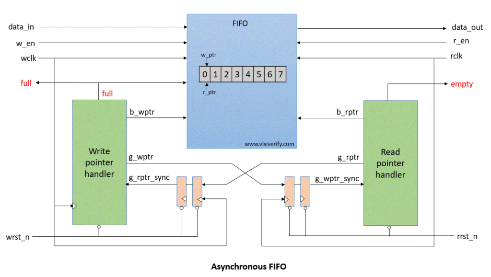

# Asynchronous FIFO Design (Verilog)

> A parameterized Asynchronous FIFO for safe data transfer between two independent clock domains.


---

##  Understanding What's Done Here

This project implements an **Asynchronous FIFO (First-In First-Out)** buffer in **Verilog**, intended for **Clock Domain Crossing (CDC)** scenarios. 

It is designed to safely transfer data between two subsystems operating under **independent clock domains**, minimizing risks of **metastability** and data loss.

The design is fully **synthesizable** and was developed and verified using **Vivado’s synthesis tools**.

> ❗ Note: This repository currently includes only the **synthesizable RTL**. No simulation or functional testbench has been added yet.
---

## 📐 Architecture

<div align="center">
  
</div>

- **Write & Read Clock Domains**
- **Gray Code Pointer Encoding**
- **Dual Flip-Flop Synchronizers**
- **Full & Empty Flag Generation**

---

## Module Descriptions


| Module         | Description                                                                                  |
|----------------|----------------------------------------------------------------------------------------------|
| `async_fifo.v` | **Top-level module** integrating write/read logic, pointer control, and status flag logic.  |
| `wr_ptr.v`     | Handles **write pointer** generation and binary-to-Gray code conversion for synchronization. |
| `rd_ptr.v`     | Handles **read pointer** generation and binary-to-Gray code conversion for synchronization.  |
| `sync.v`       | Implements a **2-stage flip-flop synchronizer** for safe pointer transfer across clock domains. |
| `dp_ram.v`     | **Dual-port RAM** block used for concurrent read/write access from independent clock domains. |

## 📌 Port Descriptions

| Signal        | Direction | Width         | Description |
|---------------|-----------|---------------|-------------|
| `wr_clk`      | Input     | 1-bit         | Write clock domain signal. Drives all write-side operations. |
| `wr_rstn`     | Input     | 1-bit (active-low) | Asynchronous reset for the write clock domain. |
| `wr_en`       | Input     | 1-bit         | Write enable signal. Writes `data_in` to FIFO when asserted and not full. |
| `rd_clk`      | Input     | 1-bit         | Read clock domain signal. Drives all read-side operations. |
| `rd_rstn`     | Input     | 1-bit (active-low) | Asynchronous reset for the read clock domain. |
| `rd_en`       | Input     | 1-bit         | Read enable signal. Reads `data_out` from FIFO when asserted and not empty. |
| `data_in`     | Input     | `WIDTH` bits  | Input data to be written into the FIFO. |
| `data_out`    | Output    | `WIDTH` bits  | Output data read from the FIFO. |
| `full`        | Output    | 1-bit         | High when the FIFO is full. Blocks further writes. |
| `empty`       | Output    | 1-bit         | High when the FIFO is empty. Blocks further reads. |


## 🔧 Parameters

```systemverilog
parameter WIDTH = 8;
parameter DEPTH = 16; 
parameter PTR_WIDTH = $clog2(DEPTH);
```

## 🧪 Results

### 📐 Synthesized RTL Schematic

Below is the RTL schematic of the top-level `async_fifo` module after synthesis using **Xilinx Vivado 2024.2**.

<div align="center">
  
</div>

## 🚧 Future Work

This repository currently includes only the synthesizable RTL. The following enhancements are planned:

- ✅ **Verification using UVM**  
  Build a complete UVM testbench to functionally verify FIFO behavior under different asynchronous conditions.

- ⏱️ **Timing and Waveform Capture**  
  Include post-synthesis timing diagrams and waveform screenshots (from Vivado or GTKWave) for visual analysis and debugging.

- 🧪 **Coverage Analysis**  
  Add functional and code coverage metrics to ensure thorough verification of all scenarios.

---

## 📚 References

- [Suburst Design: Asynchronous FIFO Design Article](http://www.sunburst-design.com/papers/CummingsSNUG2002SJ_FIFO1.pdf)  
  *Cliff Cummings' seminal paper on reliable asynchronous FIFO design and Gray code pointers.*

- [VLSI Verify: Asynchronous FIFO Design Tutorial](https://vlsiverify.com/verilog/verilog-codes/asynchronous-fifo/)  
  *A simplified walk-through of the asynchronous FIFO architecture, including Verilog implementation.*

---

> These references were used to study, plan, and validate the architecture and logic of the FIFO implemented in this project.
